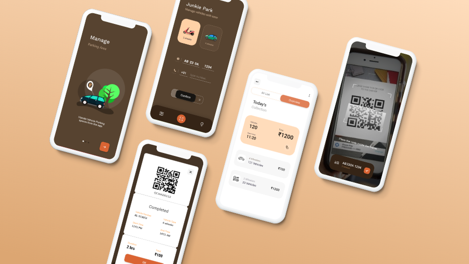
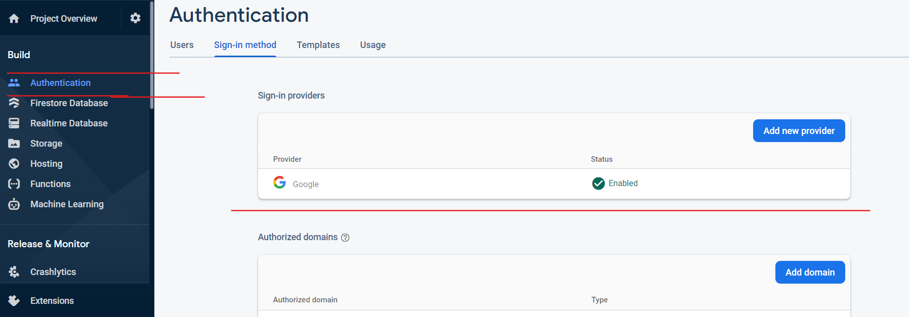
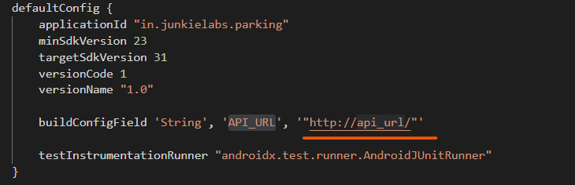

---

---

## Junkie Parking Android App 

A Simple Parking Model with simplistic design.
This repo is made in Kotlin Language with Firebase authentication and connected with Rest api.

This project contains all of the latest technologies, from design to developemnt, and common features needed to build an release ready android app.

 

## Table of contents
- [About](#about)
- [Getting started](#getting-started)
- [Features](#features)
- [Components](#components)
- [FAQ](#faq)
- [connect](#further-help)

 

# Getting Started:

### **Initial Setup**

Step 1: Create a Firebase Project.

Step 2: Add package in the firebase project

Step 3: Enable google auth, this will be needed for authorizing App.

Step 4: Download the `google-services.json` from the firebase and add inside the app folder.

> for more detail visit [Firebase Project setup](https://firebase.google.com/docs/android/setup)

 

### **For Backend**

 You have to create backend for this project. Or Run our backend from [this repo](https://github.com/JunkieLabs/junkie-parking-rest-api).

 

### configure app/build.gradle file

- change API_URL value to your server api url

 

# Features:

> These are some of the important features implemented in this starter!

 

- **View Model Structure**
  - All functional logics are pared inside Viewmodel and Fragment/Activity used only for Naviagtion logics.
  
 

- **Coroutines Events**
  - Used in place of asynchronous programming .  
  - Used in Cases when events/callback is needed From ViewModel to Activity/Fragment. For Detail, [see here](app\src\main\java\in\junkielabs\parking\tools\livedata)

 

- **Rest Api in Retrofit**
  - Retrofit library for HTTP request.  
  - Moshi Converter used to parse JSON in Kotlin.
  - For more details , [ see here](app\src\main\java\in\junkielabs\parking\components\api\ApiModule.kt) 

 

 

# Components:

> These are some of the important components in this app!

- **Qr Scanner**
- **Motion Layout Animations**
- **Ticket**
  
 

## Qr Scanner

ZXing ("zebra crossing") an open-source library is used for Qr Code Scanning.

- Used in [ActivityQrScanner](app\src\main\java\in\junkielabs\parking\ui\common\scanner) with Camera Api to scan Qr code. 

- Used Inside [CheckInOut Ticket Dialogs](app\src\main\java\in\junkielabs\parking\ui\common\checkinout\dialogs) to create Qr Code image from code.

 

## Motion Layout Animations

MotionLayout is Extended Class of ConstraintLayout. Used for making animation inside widgets. 

- Used in implementation of CheckInOut Button button Animation. See layout [checkinout_slide.xml](app\src\main\res\layout\checkinout_slide.xml)

> For examples visit: [`Motion Layout Examples`](https://developer.android.com/training/constraint-layout/motionlayout/examples)

 

## Ticket

[`TicketView`](app\src\main\java\in\junkielabs\parking\ui\widgets\TicketView.kt) is Used to Create [`Ticket Dialogs`](app\src\main\java\in\junkielabs\parking\ui\common\checkinout\dialogs)

---

 

# FAQ:

### Does this project require backend Api?

>  Yes! This App won't run without backend. You can create this on any platform like nodejs, python, spring etc.

> We will soon open source backend code.

# Special Thanks:

A special thanks to other 3rd party libraries and resource, which we have used in this project.

- Mohammad Reza Eram: [TicketView](https://github.com/mreram/TicketView)

- Tyulkanov Igor: [MaskedEditText](https://github.com/Gary111/MaskedEditText)

- Divyanshu Bhargava: [Reveal Animation](https://gist.github.com/divyanshub024/87fc43c5265e78733e2ad6a00dfbc00e)

- John Codeos: [Rest Client Setup with Retrofit](https://johncodeos.com/how-to-parse-json-with-retrofit-converters-using-kotlin/)

 

# Further help

This project is an open-source initiative by Junkie Labs.

For any questions or suggestions send a mail to junkielabs.dev@gmail.com or chat with the core-team on gitter.

 
 

# License

[MIT License](/LICENSE).

---

